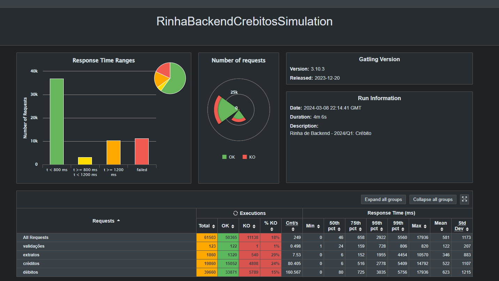
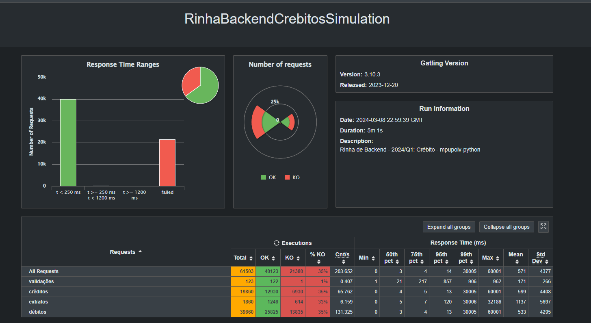

# Submissão para Rinha de Backend, Segunda Edição: 2024/Q1 - Controle de Concorrência

 

 

## Murilo Pupo de Oliveira
Submissão feita com:
- `nginx` como load balancer
- `postgres` como banco de dados
- `python` para a API utilizando `async`, `FastAPI`, `Pydantic` e `SQLAlchemy`.
- [repositório da api](https://github.com/mpupo/rinha-backend-2024-q1-python/)
- [repositório da rinha](https://github.com/zanfranceschi/rinha-de-backend-2024-q1)

[Linkedin](https://linkedin.com/in/murilo-pupo-de-oliveira)

[Email](mailto:murilo.pupo@ymail.com)

## Resultados
Rodar os testes seguindo os passos descritos em:
- [repositório da rinha](https://github.com/zanfranceschi/rinha-de-backend-2024-q1)
- [repositório da rinha backup](https://github.com/mpupo/rinha-de-backend-2024-q1)

#### Resultado local

#### Resultado oficial
Os critérios foram especificados [aqui](https://github.com/zanfranceschi/rinha-de-backend-2024-q1/blob/main/RESULTADOS.md).

## Aprendizados
### 1. Gerenciamento de conexões com o banco de dados
No início encarei muitos problemas com `asyncpg.exceptions.TooManyConnectionsError: sorry, too many clients already`, mesmo após o fim do script de testes (sinal de que as conexões não estavam sendo fechadas da maneira correta).
Após investigar o problema, descobri que era a maneira no qual estava utilizando a `Session` do SQLAlchemy. Inclusive, descobri que uma otimização¹ que finalizava a conexão ANTES de a resposta ser retornada ao cliente, o que com certeza aumentou o meu fôlego entre a enorme quantidade de chamadas.

Links:
[1. Deep Dive into Asynchronous SQLAlchemy - Transactions and Connections — Damian Wysocki (@d-wysocki)](https://youtu.be/Ehhq5oYbbuY?si=IDorglU5ukE4A_LU&t=212)

### 2. Criação e otimização de um docker container com FastAPI
Desde o início a ideia era criar um Dockerfile com:
1. Boas práticas de criação de imagem (Multi-stage build)
2. Gerenciamento de usuários e permissões de forma segura
3. Boa documentação e autossuficiente (não depender da especificação do docker-compose para rodar)

O primeiro item foi fácil de realizar ao utilizar o `poetry` como gerenciador de dependência.
O segundo levou um tempo considerável, pois tive que destrinchar o Google, StackOverflow e derivados para solucionar alguns problemas de permissão de arquivos entre os usuários do container versus o usuário padrão do Docker, no qual acabei resolvendo com shared-volumes e a correta especificação de volumes no Dockerfile da API.
O terceiro foi um pouco mais difícil do que o primeiro, mas bem mais fácil que o segundo, pois apenas tive que me basear nas imagens oficiais para entender como tornar a imagem customizável em tempo de execução (através de variáveis de ambiente) e que também fosse possível customizar através do docker-compose (que não aceita instruções `ARG`). Além disso foi interessante pesquisar sobre a diferença `ENTRYPOINT` e `CMD`.

### 3. Otimização de banco de dados e load balancer
A etapa que levou mais tempo, pois necessitava de uma nova execução dos testes de carga para que pudesse saber se a alteração surtiu efeito. Tentei balancear entre boas práticas e velocidade, mas com certeza o resultado acabou tendendo mais para um número maior nos números do teste (principalmente com o `UNLOGGED TABLE` e o desligamento de algumas configurações de prevenção de erros e/ou manutenção de ambos os pontos da infraestrutura).
